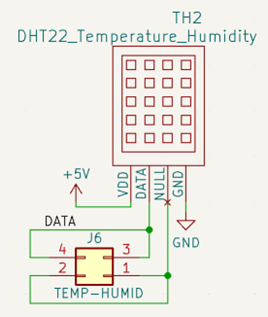
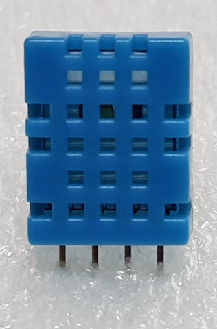
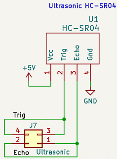
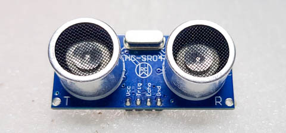

# Training_Base
Training board base

## Components ##

### Temperature and Humidity sensor ###
 

 

 

### Ultrasonic sensor ###

 
 
 

## Design tool ##

### Kicad ### 
รุ่นที่ใช้เป็นรุ่น nightly ดาวน์โหลดได้จากที่นี่ครับ

สำหรับ Windows 
https://downloads.kicad.org/kicad/windows/explore/nightlies

